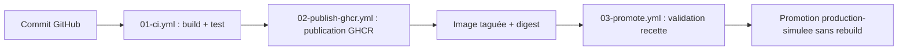

# 02 - Schéma de la chaîne CICD

## Schéma logique

## Explication

- **Commit GitHub** : chaque `git push` déclenche automatiquement les workflows concernés grâce aux triggers `on: push` et `on: pull_request`.
- **01-ci.yml (build + test)** : récupère le code, vérifie la présence des fichiers attendus, construit l'image Docker à partir du `Dockerfile`, puis lance un conteneur de test et vérifie avec `curl` que le site répond correctement (page d'accueil et `version.json`). Ce workflow s'exécute sur tout push ou pull request, donc avant toute publication.
- **02-publish-ghcr.yml (publication GHCR)** : déclenché uniquement sur push vers `main`. Il construit à nouveau l'image (buildx) et la publie dans GitHub Container Registry avec deux tags : `sha-<commit>` (traçabilité exacte) et `latest` (dernière version stable). Le digest de l'image est affiché dans le résumé du run.
- **Image taguée + digest** : chaque image publiée est identifiée de façon unique par son tag et par son digest (empreinte SHA256 du manifeste), ce qui garantit qu'on sait exactement quel contenu a été déployé, indépendamment du nom du tag.
- **03-promote.yml (validation recette)** : déclenché manuellement (`workflow_dispatch`) avec en entrée le tag à promouvoir. Le job `validate-recette` télécharge l'image déjà publiée (sans reconstruction), la lance et vérifie qu'elle répond correctement en HTTP, dans l'environnement GitHub `recette`.
- **Promotion production-simulee sans rebuild** : si la validation recette réussit, le job `promote-production-simulee` réutilise le même artefact téléchargé (`docker pull` puis `docker tag` puis `docker push`) et le republie sous le tag `production-simulee`, dans l'environnement GitHub `production-simulee`. Aucune reconstruction n'a lieu à cette étape : c'est exactement le même artefact binaire qui est promu, ce qui garantit que ce qui a été testé en recette est ce qui est déployé.

## Orchestration légère

Le fichier compose.yml décrit un service web et un second service de test. Il sert à documenter et simuler une coordination de conteneurs, sans prétendre remplacer une orchestration de production.

- **Service `web`** : construit l'image à partir du `Dockerfile` local et expose le port 80 en interne sur le réseau `cicd_net`.
- **Service `tester`** : second service, basé sur `curlimages/curl`, qui dépend de `web` (`depends_on`) et exécute automatiquement des requêtes HTTP vers `http://web/` et `http://web/version.json` dès que le service web est démarré. Ce second service illustre la coordination de plusieurs conteneurs sur un même réseau, en simulant un test d'intégration local.

## Limite importante

Docker Compose est utile pour une mise en situation, un test local ou une démonstration de coordination. En production réelle, il faudrait traiter d'autres sujets : haute disponibilité, répartition de charge, supervision, politique de déploiement, rollback, sécurité, sauvegarde et restauration.
